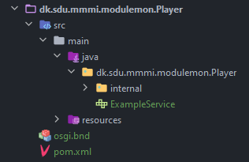
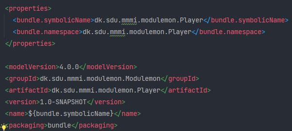
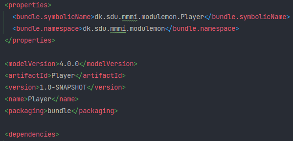
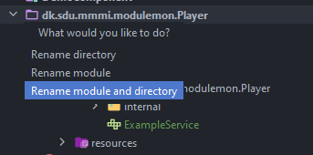

# SemesterProject-4
GitHub page for the 4th semester project on SDU


## Authors
* [Alexander Vinding Nørup](https://github.com/AlexanderNorup)

* [Jonas Solhaug Kaad](https://github.com/JonasKaad)

* [Magnus Kjær Sørensen](https://github.com/magnuskjaer)

* [Victor Andreas Boye](https://github.com/VictorABoye)

* [Gorm Emil Smedegaard Krings](https://github.com/Gorm2303)

* [Sebastian Christensen Mondrup](https://github.com/SebMon)

### Branch naming convention
You should name your branch <**issuenumber**\>-\<**some-description**\>

So for example, changing to a branch should be `git checkout 7-Setup-Project`

### Linking issues and branchen
When you have created your branch, create a pull request (draft) for the branch and link the pull request to the issue

## OSGi
Below will be a quick guide on how to use OSGi and how to run the project.
### Creating a new bundle:
We're using Maven and Pax to create the bundles. We're also going to be using Dependency Injection. 
To create a new bundle use: \
`mvn pax:create-bundle "-Dpackage=dk.sdu.mmmi.modulemon.NAME" "-Dversion=1.0-SNAPSHOT"`

Where NAME is replaced by the actual name of the bundle you want it to be named. This gives us the following structure.
However, we want the actual name to be just "Player" in this case:



To change this, we first go in to the `pom.xml` and change some settings.
Below is a comparison:

Before changing the settings:



After changing:



Essentially what we do is change `<name>` and `<artifactId>` to be the desired name, in this case Player.
We also remove the `<groupId>`, such that the one found in the `<parent>` will be used. Lastly we also correct the 
namespace to be just `dk.sdu.mmmi.modulemon`.

Finally, we also need to refactor the package itself, such that it matches up with the `pom.xml` file.
In this case we would rename the module and directory to "Player".



We also need to go into the root `pom.xml` file and change the reference it has to the module. Currently it would look
something like this:
```
<module>dk.sdu.mmmi.modulemon.Player</module>
```
This should be changed to reflect the new name, i.e. in this case Player. `<module>Player</module>`.

\
\
The module is now ready to be used. To start off we can simply remove the code already found in the bundle, i.e.
the `internal` package and the `ExampleService` file. Remember to also delete the content in the `osgi.bnd` file, since
it from default is set up to use `BundleContext`. We can now create our own code within the bundle and use the `osgi.bnd` to declare our services and use Dependency 
Injection.

### How to run the project from IntelliJ
To run the project from IntelliJ we use the Maven. For easy use, we set up a run configuration.
Simply use the command `pax:provision` to run it. However, after changing anything in the project, be it some code
or a new module, remember to run the command `install -f pom.xml` and if you want to be safe do a `clean install`, 
to make sure everything is installed properly.

- Install new modules / update code: `clean install -f pom.xml`
- Run project: `pax:provision`